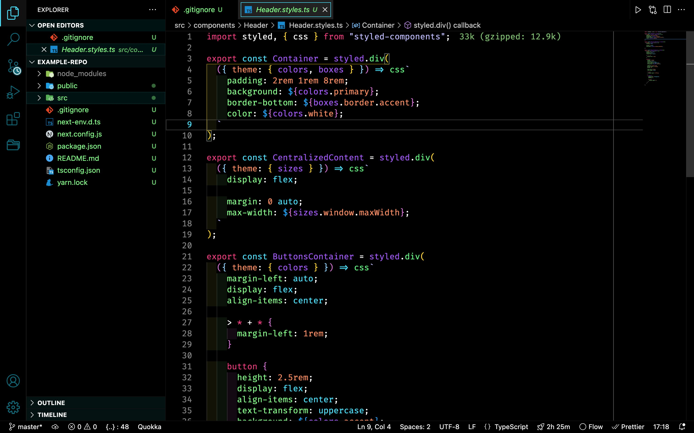

# Oled Neon Dark

A theme for your oled display with a neon accent

### NOTES:

- Make sure in your settings the option `editor.semanticHighlighting.enabled` is not false. If this setting is not present in your file, the default value will be `configuredByTheme`

